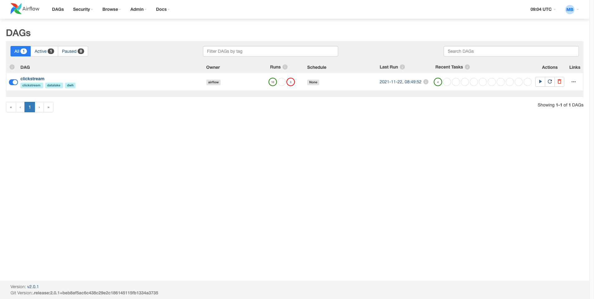
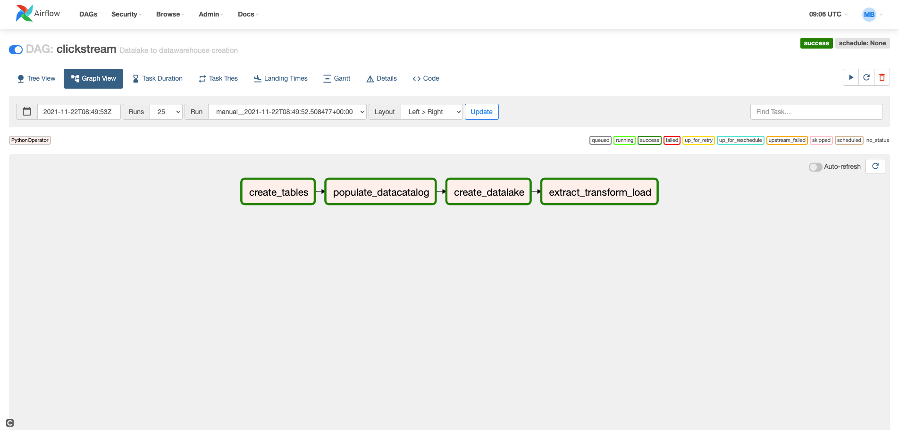

# Clickstream-Datawarehousing

Datawarehousing clickstream data with datalake

# Setup

## Setting up the postgres database

```
cd compose/db
docker-compose up -d
```

## Setting up the `.env`

Place the `.env` file in the root of the project.

## Setting up the virtual environment

Conda is the preferred environment manager for my python ecosystem. I have worked with `python 3.7.1`

```
conda create -n clickstream python=3.7 pip --y
conda activate clickstream
```

Now we can install the packages.

```
pip install -r pip_reqs.txt
```

Above one is preferred (generated by `pip freeze > pip_reqs.txt`), but the other is also fine (generated by `pipreqs . --encoding utf-8 --force`).

```
pip install -r requirements.txt
```

## Setting up the airflow environment

Airflow is being used for workflow or pipeline management.

Below is the config for airflow setup but it can be skipped (all setup are done already). You should skip from here to

```
# Configurations
export AIRFLOW_HOME=${PWD}/airflow
AIRFLOW_VERSION=2.0.1
PYTHON_VERSION="$(python --version | cut -d " " -f 2 | cut -d "." -f 1-2)"
CONSTRAINT_URL="https://raw.githubusercontent.com/apache/airflow/constraints-${AIRFLOW_VERSION}/constraints-${PYTHON_VERSION}.txt"

# Install Airflow (may need to upgrade pip)
pip install "apache-airflow==${AIRFLOW_VERSION}" --constraint "${CONSTRAINT_URL}"

# Initialize DB (SQLite by default)
airflow db init
```

```
# Inside airflow.cfg
enable_xcom_pickling = True  # needed for Great Expectations airflow provider
load_examples = False  # don't clutter webserver with examples
```

```
airflow db reset
```

```
# We'll be prompted to enter a password
airflow users create \
    --username admin \
    --firstname Mobasshir \
    --lastname Bhuiyan \
    --role Admin \
    --email mobasshirbhuiyan.shagor@gmail.com
```

upto this point.

Reset airflow db with the following script and set the admin password `admin`.

```
bash init_airflow_db.sh
```

Launch webserver with the following script.

```
bash start_airflow.sh
```

Credentials:

```
user: admin
password: admin
```

Now you can login to the web `http://localhost:8080/` with above creds and go to the `dags` section and will find a dag named `clickstream` and manually trigger to run the dag with the play button.




To stop the webserver and scheduler, use the following script.

```
bash stop_airflow.sh
```

Please go to `QA.ipynb` for answers to the questions.
